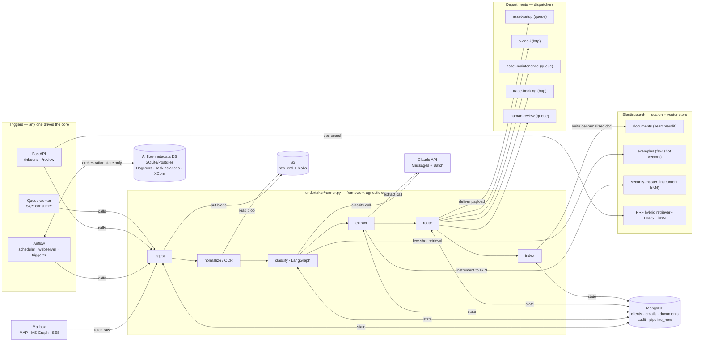
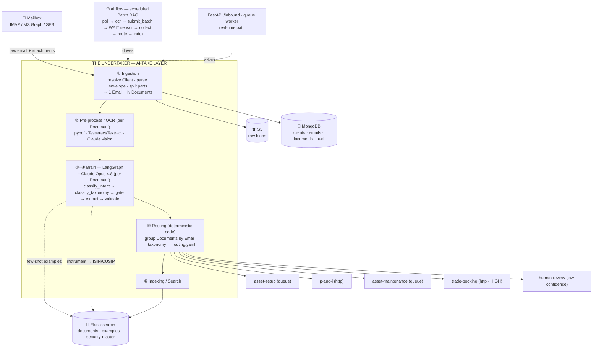
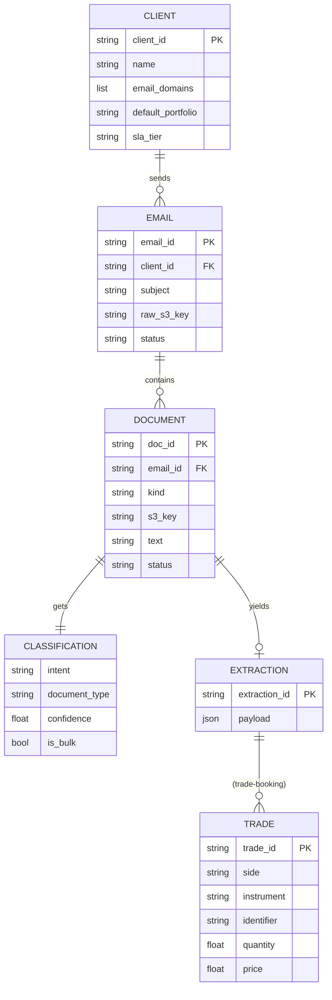
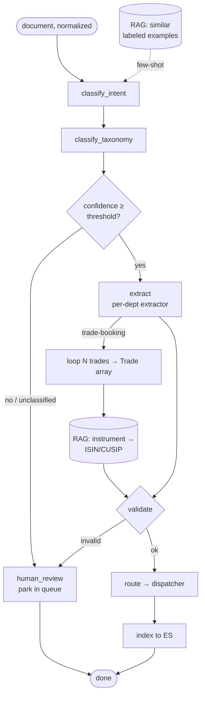

# The Undertaker — System Diagrams

Render these in VS Code's Markdown preview (with a Mermaid extension) or on GitHub.

## 0. Full architecture — what connects to what

Component + connectivity view: every service, and the direction/purpose of each
link. Airflow is a *trigger* that calls the core and keeps its own metadata DB;
Elasticsearch is written by indexing and read at three RAG points.



## 1. End-to-end flow



## 2. Entity model



## 3. The LangGraph brain (per document)



## 4. Two run modes

```mermaid
flowchart LR
    subgraph B["Batch (DEFAULT · 500-email scale)"]
        direction TB
        A1[Airflow hourly] --> A2[ingest → ocr] --> A3["ONE Claude Batch<br/>~50% cheaper, async"] --> A4[wait-for-batch sensor] --> A5[collect → extract → route → index]
    end
    subgraph R["Real-time (urgent single email)"]
        direction TB
        R1[FastAPI /inbound or queue] --> R2[land → ocr] --> R3["run_pipeline(doc)<br/>concurrency-capped"] --> R4[route → index]
    end
    B -. same runner.py functions .- R
```
